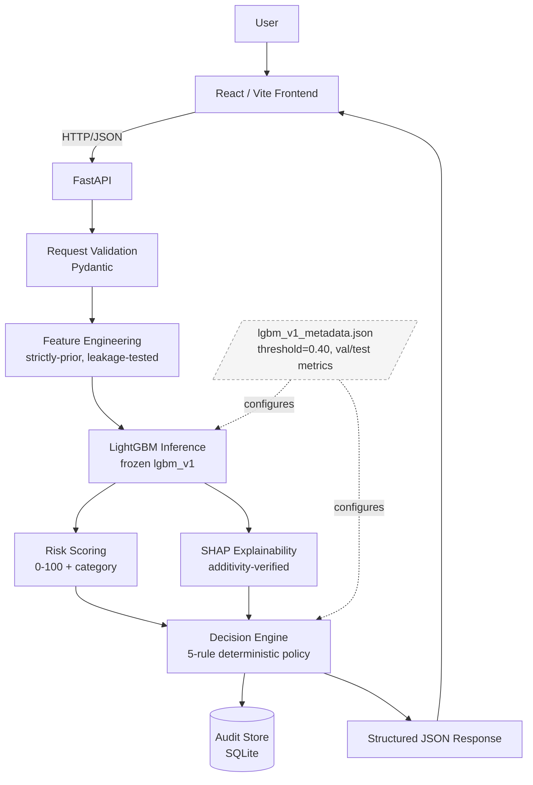

# MerchantShield AI

**An end-to-end explainable transaction-risk decisioning system.**

Given a payment transaction and its customer's recent history, MerchantShield estimates a
fraud probability with a trained LightGBM model, explains that estimate with SHAP, and
recommends a bounded action (allow / monitor / step-up / block) using a transparent,
rule-based policy — never an irreversible financial action.

> **Prototype scope.** Built as a buildathon submission using synthetic transaction data.
> Not connected to any real payment processor. No authentication. Not production-hardened.
> See [Limitations](#limitations--prototype-scope) and
> [External validation](#external-validation--ieee-cis) below for what this means for the
> reported metrics.

---

## Contents

[The problem](#the-problem) · [Key capabilities](#key-capabilities) ·
[Architecture](#architecture) · [Tech stack](#tech-stack) · [Dataset](#dataset) ·
[ML pipeline](#ml-pipeline) · [Model results](#model--evaluation-results) ·
[Decision engine](#decision-engine) · [Explainability](#explainability) ·
[External validation](#external-validation--ieee-cis) ·
[Audit trail](#audit-trail) · [API](#api) · [Frontend](#frontend--dashboard) ·
[Screenshots](#screenshots) · [Project structure](#project-structure) ·
[Local setup](#local-setup--running-the-project) ·
[Testing](#testing) · [Limitations](#limitations--prototype-scope)

---

## The problem

Fraud detection systems often fail rigorous scrutiny for three compounding reasons:
they report accuracy on a class-imbalanced dataset (meaningless at 1–3% fraud rates),
they pick a 0.5 classification threshold without cost justification, and they can't
explain a specific decision to a human reviewer. MerchantShield was built to address
all three simultaneously.

Beyond raw classification, real fraud systems need a *decisioning* layer: a model
probability of 0.45 does not answer "should we block this transaction?" — that depends
on the false-positive cost, the fraud amount, and business policy. MerchantShield
separates these concerns cleanly: the model estimates probability, a deterministic cost
function selects the threshold, and a separate rule-based policy converts probability
into a bounded, auditable action.

## Key capabilities

- **Leakage-safe feature engineering** — all 15 behavioural features are computed
  strictly from transactions before the one being scored; dedicated tests verify this
  property by re-running the feature computation for sampled customers and checking
  it matches the historical sequence exactly.
- **Cost-driven model selection and threshold** — three models compared on an explicit
  FP/FN cost function, not accuracy alone. The operating threshold (0.40) was chosen
  by sweeping thresholds against the cost model on a held-out validation set, then
  evaluated exactly once on the test set.
- **Grounded SHAP explainability** — every scored transaction gets a per-feature
  explanation derived from real SHAP values, with a mathematical additivity check
  (`base + Σshap ≈ predict_proba`) run on every call.
- **Deterministic, auditable decision policy** — a five-rule ordered table converts
  probability into one of four bounded actions. SHAP explanations are structurally
  incapable of influencing the action; this is enforced by the function signature and
  proven by a dedicated test.
- **REST API** — FastAPI with full input validation, structured error responses, model-
  unavailable graceful degradation, and an audit-write failure isolation layer.
- **React dashboard** — consumes only the documented API contract; never imports
  backend Python; SHAP contribution bars and verbatim action labels.
- **External validation** — the model and methodology were tested against the
  IEEE-CIS Fraud Detection dataset (real Vesta chargeback data). See
  [External validation](#external-validation--ieee-cis) for the honest results.

## Architecture

```
Transaction + prior history
        │
        ▼
Pydantic validation (FastAPI)
        │
        ▼
Feature engineering — strictly-prior, leakage-tested (build_features.py)
        │
        ▼
LightGBM inference — frozen model artifact (lgbm_v1)
        │
        ├──────────────────────────────────┐
        ▼                                  ▼
Risk score / category              SHAP explanation
(0–100, deterministic mapping)     (grounded, additivity-verified)
        │                                  │
        └──────────────┬───────────────────┘
                       ▼
             Decision engine — 5-rule policy
             (probability + amount only; SHAP cannot influence action)
                       │
                       ├──▶ Audit persistence (SQLite)
                       │
                       ▼
             Structured JSON response
                       │
                       ▼
             React / Vite dashboard (HTTP/JSON only, no backend imports)
```



Three independently-auditable layers: the model estimates probability → a deterministic
module converts it to a 0–100 risk score for legibility → a separate deterministic
module decides the bounded action. Changing how risk is *displayed* can never silently
change what *action* is taken.

## Tech stack

| Layer | Technology |
|---|---|
| ML / data | Python, pandas, NumPy, scikit-learn, LightGBM, SHAP, scipy |
| Backend | FastAPI, Pydantic, SQLAlchemy + SQLite |
| Frontend | React 19, Vite, plain CSS (no UI framework) |
| Testing | pytest, FastAPI TestClient |
| Containerisation | Docker (multi-stage build), docker-compose |

No Kubernetes, no message queue, no auth layer, no extra databases — deliberately
minimal for a buildathon prototype.

## Dataset

The primary dataset is **synthetic and generator-controlled** — chosen so the
feature-engineering work is real and inspectable rather than operating on pre-
anonymized PCA columns. The generator and feature pipeline are separate processes
so fraud labels aren't trivially recoverable from the engineered features.

- ~213,000 transactions, 2,200 synthetic customers, 60-day window, ~1.5% fraud rate
- **Chronological split** (train: days 0–39, validation: 40–49, test: 50–59) —
  not random — to prevent leakage through time-aware velocity and behavioral features
- 15 engineered features (velocity windows, amount z-score, device/geo novelty,
  failed-transaction ratio, account age, time-of-day), each computed **strictly from
  prior transactions**, enforced by dedicated leakage tests

**No real payment data was used.** No Razorpay, Visa, Mastercard, or bank data.
All reported metrics are on this synthetic dataset unless explicitly labelled
[External validation](#external-validation--ieee-cis).

## ML pipeline

```
generate_synthetic.py        → ml/data/raw_transactions.csv
build_features.py            → ml/data/features.csv (15 leakage-safe features)
train_baseline.py            → Logistic Regression baseline + chronological_split utility
train_candidates.py          → LightGBM + Random Forest candidates, cost-based selection
threshold_analysis.py        → sweep thresholds on validation, freeze at cost minimum
risk_scoring.py              → probability → 0-100 score + LOW/MEDIUM/HIGH/CRITICAL
explainability.py            → SHAP TreeExplainer, additivity check, human-readable reasons
decision_engine.py + policy.py → 5-rule policy, ALLOWED_ACTIONS, audit record
```

All scripts are in `ml/` and are re-runnable. The frozen model artifact
(`ml/models/candidate_lgbm_v1.pkl`) and metadata (`ml/models/lgbm_v1_metadata.json`)
are committed so the API runs without retraining.

## Model & evaluation results

All numbers are on the **held-out test set** (days 50–59; never used during model
selection or threshold tuning). Comparison was based on validation-set expected cost,
not accuracy or ROC-AUC alone.

| Model | Precision | Recall | F1 | PR-AUC | FP | FN | Est. cost (test) |
|---|---|---|---|---|---|---|---|
| Logistic Regression (baseline) | 0.448 | 0.825 | 0.581 | 0.739 | 730 | 126 | ₹110,582 |
| Random Forest | 0.746 | 0.868 | 0.802 | 0.883 | 213 | 95 | ₹68,479 |
| **LightGBM (selected)** | **0.785** | **0.882** | **0.830** | 0.901 | 174 | 85 | **₹41,377** |

**Selected operating threshold: 0.40** — chosen by minimising expected cost on
validation (FP cost: ₹50 flat; FN cost: 0.5 × transaction amount) subject to a
minimum 80% fraud recall. Not the default 0.5; not the F1-maximising threshold (0.80,
which costs ~38% more under the asymmetric cost function).

The chart below is the actual precision/recall/F1 and estimated cost vs. threshold
sweep on the **validation set**:


Full threshold sweep, cost-sensitivity analysis, and all reproducible scripts are in
`ml/evaluation/threshold_analysis.py` and `ml/models/lgbm_v1_metadata.json`.

## Decision engine

A five-rule policy table converts a fraud probability (and transaction amount) into
a bounded action recommendation. Rules fire in order; first match wins.

| Rule | Condition | Action |
|---|---|---|
| `CRITICAL_BLOCK` | probability ≥ 0.80 | `BLOCK` |
| `HIGH_STEP_UP` | probability ≥ 0.40 | `STEP_UP_VERIFICATION` |
| `MEDIUM_AMOUNT_ESCALATION` | probability ≥ 0.15 and amount ≥ ₹25,000 | `STEP_UP_VERIFICATION` |
| `MEDIUM_MONITOR` | probability ≥ 0.15 | `ALLOW_WITH_MONITORING` |
| `LOW_ALLOW` | (catch-all) | `ALLOW` |

Every action is a **recommendation only** — the system cannot move money, freeze
accounts, or contact anyone. `ALLOW_WITH_MONITORING` is a policy label; no background
monitoring service exists in this prototype. `SHAP` explanations cannot influence the
action — `evaluate_policy()` accepts only `(probability, amount)`, enforced by
function signature and verified by dedicated tests. Full design rationale and all
boundary-condition tests are in [`docs/decision_engine.md`](docs/decision_engine.md).

## Explainability

Every `/risk/evaluate` call returns:
- **SHAP contributions** for all 15 features (real values from the model, not
  templates or LLM-generated text)
- **Additivity check**: `base_value + Σ(shap_values) ≈ predict_proba` verified on
  every call (tolerance < 0.0001)
- **Grounded narrative**: top contributing features phrased as "Transaction amount
  is 2.3 standard deviations above this customer's historical average, which
  increased risk" — built from the actual `(feature, value, shap_value)` triple
- **Correct framing**: "Why this was flagged" vs. "Why this was NOT flagged" chosen
  from the actual model output, not hardcoded

Limitations (correlated-feature credit-splitting, local-not-global) are documented
in [`docs/explainability.md`](docs/explainability.md).

## External validation — IEEE-CIS

The model and methodology were tested against the
[IEEE-CIS Fraud Detection dataset](https://www.kaggle.com/c/ieee-fraud-detection)
(real e-commerce chargeback data from Vesta Corporation, ~590k transactions, 3.5%
fraud rate). The dataset is not committed to this repository — it must be downloaded
from Kaggle.

**This is an important honesty note:** the production `lgbm_v1` model was trained on
MerchantShield's synthetic data. IEEE-CIS is a different domain with different feature
distributions, different fraud patterns, and higher prevalence. The two datasets are
not directly comparable.

### Experiment A — Frozen model transfer (lgbm_v1 at threshold 0.40 on IEEE-CIS)

| Metric | Result |
|---|---|
| ROC-AUC | **0.443** (below 0.5 — ranking is inverted) |
| Recall at 0.40 | 0.5% |
| Fraud caught | 19 of 4,064 |

**The frozen model does not generalise to IEEE-CIS.** Root cause: the model was
calibrated to 1.6% fraud prevalence on a synthetic distribution; on IEEE-CIS at 3.5%
prevalence the `amount_zscore` feature encodes entirely different semantics (cards with
thousands of prior transactions produce extreme z-score values that the synthetic model
never encountered), causing the probability ranking to invert.

### Experiment B — Retrained on IEEE-CIS (methodology transfer)

A fresh LightGBM was trained from scratch on the IEEE-CIS training split using
MerchantShield's feature engineering approach (13 of 15 features computable; 2 features
— device novelty and failure ratio — are absent from IEEE-CIS data):

| Metric | Phase 14 baseline | Phase 15 (+card_product_share) |
|---|---|---|
| ROC-AUC | 0.753 | **0.771** |
| PR-AUC | 0.114 | **0.128** |
| Precision | 0.057 | **0.066** |
| Recall | 0.804 | 0.776 |
| F1 | 0.106 | **0.122** |
| False positives | 54,079 | **44,502** (−17.7%) |
| Expected cost | 2,763,187 | **2,294,373** (−17.0%) |
| FP:TP ratio | 16.6 | **14.1** |

† Phase 15 used a 0.05-step threshold sweep; Phase 17 used a 0.01-step sweep — same
methodology, higher resolution. Minor metric differences (e.g. threshold 0.37 vs 0.35)
reflect this, not a change in approach.

Phase 15 added `card_product_share` (fraction of a card's prior transactions in the
current product category) — the 3rd most important feature by gain, reducing FP by
18% and cost by 17%.

**Overall conclusion: PARTIAL TRANSFER.** The feature engineering approach captures
meaningful fraud signal on real data (ROC-AUC 0.77, beats LR and naive baselines).
Low precision (6.6%) is structurally explained by the 3.5% prevalence ceiling and the
two absent features. The frozen model does not transfer — the synthetic and real
distributions are too different.

### Phase 17 — Held-out real-data evaluation (Razorpay submission)

Phase 17 provides the canonical held-out evaluation answering the Razorpay AI Risk
Manager track requirement: *"measured precision and recall on a held-out test set,
including false-positive cost."*

A fresh LightGBM was trained on the IEEE-CIS training split (16 features: 15 base +
`card_product_share`) and evaluated **exactly once** on the held-out test split
(118,108 transactions, days 140–182) after threshold selection on validation only:

| Metric | Value |
|---|---|
| ROC-AUC | **0.771** |
| PR-AUC | **0.128** |
| Precision | **0.063** |
| Recall | **0.798** |
| F1 | **0.117** |
| Fraud caught (TP) | 3,243 of 4,064 **(79.8%)** |
| False positives (FP) | 48,139 |
| FP:TP ratio | 14.8 |
| False positive rate | 42.2% |
| Expected cost | 2,469,531 cost units |
| Selected threshold | 0.35 (val cost-min, recall ≥ 80%) |

**Confusion matrix (held-out test set):**

| | Predicted legitimate | Predicted fraud |
|---|---|---|
| **Actually legitimate** | 65,905 (TN) | 48,139 (FP) |
| **Actually fraud** | 821 (FN) | 3,243 (TP) |

> *IEEE-CIS is US e-commerce data from Vesta Corporation, not Razorpay/UPI/POS transactions.*

**Low precision (6.3%) explained honestly:** The 3.5% fraud prevalence sets a
structural ceiling; two key fraud signals (device novelty, failure-transaction ratio)
are absent from IEEE-CIS; and IEEE-CIS label propagation adds noise. This is not a
model failure — it is a data-compatibility constraint documented in full.

**The IEEE-CIS data is not committed to this repository.** Set `IEEE_DATA_DIR` to
reproduce:
```bash
export IEEE_DATA_DIR=/path/to/ieee_cis_data
python ml/external/ieee/razorpay_validation.py
```

Full analysis in
[`docs/phase17_razorpay_real_data_validation.md`](docs/phase17_razorpay_real_data_validation.md),
[`docs/external_validation_ieee_cis.md`](docs/external_validation_ieee_cis.md), and
[`docs/phase15_card_product_experiment.md`](docs/phase15_card_product_experiment.md).

## Audit trail

Every `/risk/evaluate` call writes: transaction ID, model version, probability,
threshold, risk score/category, action, policy rule, policy reason, SHAP top-reasons,
decision timestamp, and source tag (`demo` or `manual`). Deliberately **not** stored:
customer ID, device ID, geo region — the audit trail proves what the system decided
and why, without becoming a copy of merchant data. If the audit write fails, the API
still returns the computed decision (`audit_persisted: false`).

## API

FastAPI backend with interactive docs at `/docs`. Full contract in
[`docs/api.md`](docs/api.md).

| Method | Endpoint | Purpose |
|---|---|---|
| GET | `/health` | Liveness + model loaded status |
| GET | `/model/info` | Frozen model metadata, threshold, val/test metrics |
| POST | `/risk/score` | Probability + risk score (no audit write) |
| POST | `/risk/explain` | + SHAP explanation (no audit write) |
| POST | `/risk/evaluate` | Full pipeline: score + explain + decide + audit |
| GET | `/audit-log` | Recent persisted decisions |

## Frontend / dashboard

A React/Vite dashboard for exploring the system: submit a transaction manually or
pick a demo scenario, view the fraud probability, risk score, decision (always shown
verbatim — `ALLOW` / `ALLOW_WITH_MONITORING` / `STEP_UP_VERIFICATION` / `BLOCK`),
SHAP-grounded explanation, and recent audit log. The frontend speaks HTTP/JSON only;
no backend Python imports. [`docs/frontend.md`](docs/frontend.md).

## Screenshots

No UI screenshots are committed — none were fabricated.
[`screenshots/README.md`](screenshots/README.md) documents exactly what to capture
(8 scenarios covering all risk tiers and UI panels) and gives both Docker and local
quick-start paths for running the app.

The threshold analysis chart (`ml/models/threshold_analysis_chart.png`) is the real
matplotlib output from Phase 5 and is shown in [Model results](#model--evaluation-results)
above.

## Project structure

```
merchantshield-ai/
├── backend/              # FastAPI app: routes, schemas, services
├── ml/
│   ├── data/             # Synthetic data generator
│   ├── features/         # Leakage-safe feature engineering (build_features.py)
│   ├── training/         # Baseline + candidate training scripts
│   ├── evaluation/       # Cost model, threshold analysis, risk scoring, SHAP, decision engine
│   ├── models/           # Frozen model artifacts + metadata (committed to Git)
│   └── external/         # External validation track (IEEE-CIS, Phases 14–17)
│       └── ieee/         # Adapter, features, split, experiments A+B,
│                         #   card_product_features (Phase 15),
│                         #   razorpay_validation.py (Phase 17 — canonical held-out)
├── frontend/             # React/Vite dashboard
├── tests/                # pytest suite: leakage, explainability, decision engine, API,
│                         #   IEEE-CIS adapter/features, card-product, Phase 17 validation
├── docs/                 # Technical documentation and experiment reports
│                         #   (see docs/README.md for index)
├── screenshots/          # Capture guide (no screenshots committed)
├── Dockerfile            # Multi-stage build: Node frontend + Python runtime
├── docker-compose.yml    # docker compose up --build
├── CONTRIBUTING.md       # Developer workflow, ML integrity rules, commit conventions
├── requirements.txt      # Pinned Python dependencies
├── .env.example
└── README.md
```

## Local setup & running the project

**Prerequisites:** Python 3.11+ (CI runs 3.13), Node.js 20.19+ or 22.12+.

### Option A — Docker

```bash
docker compose up --build
# http://localhost:8000          → dashboard
# http://localhost:8000/docs     → interactive API docs
```

The image generates the synthetic dataset and builds the frontend at image-build time.
Audit decisions persist via the `audit_data` named volume.

> **Note:** The Dockerfile is CI-verified (Node 22.12.0-slim + python:3.13-slim,
> matching CI exactly) but was not end-to-end run-tested in a Docker daemon during
> development. If you encounter issues, use Option B.

### Option B — Local setup

```bash
# 1. Install Python dependencies
pip install -r requirements.txt

# 2. Generate the synthetic dataset (not committed — CSVs are large and reproducible)
python ml/data/generate_synthetic.py       # → ml/data/raw_transactions.csv
python ml/features/build_features.py       # → ml/data/features.csv

# 3. Build the frontend
cd frontend && npm install && npm run build && cd ..

# 4. Start the backend (serves the frontend at the same origin)
python -m uvicorn backend.main:app --host 127.0.0.1 --port 8000

# 5. Open http://127.0.0.1:8000
```

For frontend live-reload development:
```bash
# terminal 1: python -m uvicorn backend.main:app --host 127.0.0.1 --port 8000
# terminal 2: cd frontend && npm run dev
```

### Regenerating the dataset / retraining

The CSVs are not committed; the scripts are. To regenerate:
```bash
python ml/data/generate_synthetic.py
python ml/features/build_features.py
```

To retrain from scratch (the frozen model artifact is already committed — this is
optional):
```bash
python ml/training/train_baseline.py
python ml/training/train_candidates.py
python ml/evaluation/threshold_analysis.py
```

## Testing

```bash
pytest tests/
```

The suite covers: dataset leakage (chronological ordering verified on sampled
customers), SHAP grounding/additivity/determinism, decision engine (all policy
branches, exact boundary conditions, fail-safe behavior, proof SHAP cannot alter the
action), API (valid requests, every documented error path, audit failure isolation),
IEEE-CIS adapter/features/split (schema, prohibited columns, future-leakage
prevention, label independence), and card-product familiarity features (35 tests).

| Test file | Focus | Notes |
|---|---|---|
| `test_decision_engine.py` | All policy branches, boundary cases, fail-safe | ~1 s |
| `test_explainability.py` | SHAP grounding, additivity, determinism | ~20 s |
| `test_api.py` | Full API contract, every error path, audit isolation | ~15 s |
| `test_no_leakage.py` | Strictly-prior feature computation on 213k-row CSV | ~3 min |
| `test_ieee_external.py` | IEEE-CIS adapter, features, split, leakage guards | ~1 min (non-integration) |
| `test_card_product_features.py` | card_product_share and sibling features | ~4 s |
| `test_phase17_validation.py` | Phase 17 pipeline: scoring, threshold selection, feature contract, result schema | ~13 s |

**Current test count: 246 non-integration tests passing** (run `pytest tests/` — 6
integration tests require the local IEEE-CIS CSV files and are automatically skipped
in CI). CI runs the full suite on every push to `main`.

**GitHub Actions CI** verifies on every push:
- Backend job (Python 3.13, ubuntu-latest): install deps → generate data → build
  features → build frontend → run full test suite
- Frontend job (Node 22.12.0, ubuntu-latest): npm ci → npm run build

## Limitations / prototype scope

- **Synthetic data only for production model.** All MerchantShield v1 metrics are on
  generator-controlled synthetic data. No real payment data was used or claimed.
- **Partial external transfer on real data.** The retrained external model achieves
  ROC-AUC 0.771 and 79.8% recall on IEEE-CIS real-world e-commerce data, but precision
  is 6.3% at the selected operating point. The frozen production model does not transfer
  (ROC-AUC 0.443). See [External validation](#external-validation--ieee-cis).
- **Not Razorpay data.** The real-data evaluation uses IEEE-CIS (Vesta Corporation
  US e-commerce). Not UPI, not POS, not Indian merchant transactions.
- **No authentication.** The API and dashboard have no login/access control.
- **No live transaction store.** Prior transaction history must be supplied per-request
  by the caller — there is no live customer database.
- **SQLite audit storage.** Appropriate for a prototype; not a production audit solution.
- **ALLOW_WITH_MONITORING is a policy label.** No background monitoring service exists.
- **No real payment integration.** Every action is a recommendation label returned as
  data. The system cannot move money or freeze accounts.
- **Docker not end-to-end run-tested.** The Dockerfile was written against CI-verified
  base images and syntax-checked, but was not executed in a Docker daemon during
  development on this machine.
