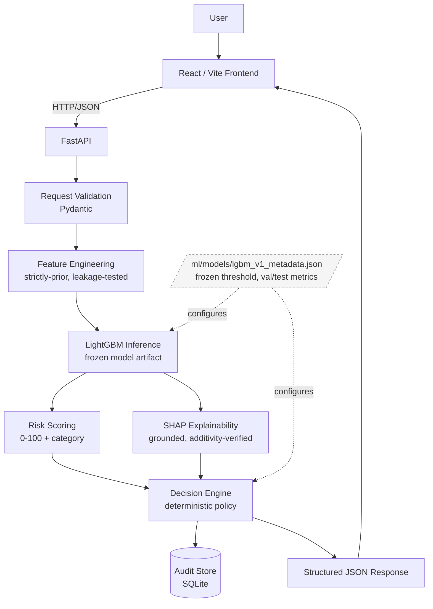
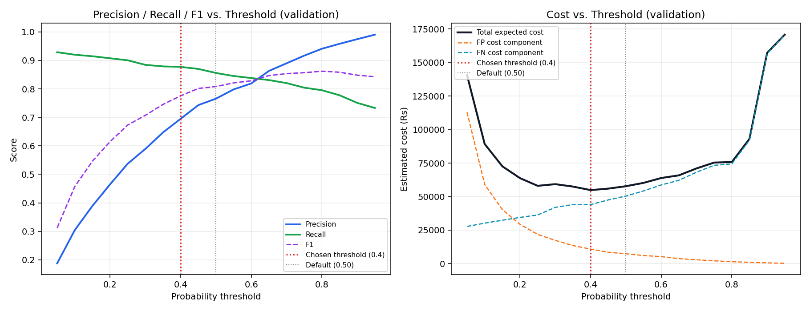

# MerchantShield AI

**AI-powered risk intelligence for merchants.**

A defensive, explainable transaction-fraud risk system built for the Razorpay AI
Buildathon 2026 (Track 02 — AI Risk Manager). Given a transaction, it estimates a
fraud probability with a trained model, explains that estimate with SHAP, and
recommends a bounded action (allow / monitor / step-up verification / block) using a
transparent, rule-based policy — never an irreversible financial action.

> **Prototype scope.** This is a buildathon submission built on synthetic data. It
> is not connected to any real payment processor, has no authentication, and is not
> production-hardened. See [Limitations](#limitations--prototype-scope) below.

---

## Contents

[The problem](#the-problem) · [Key capabilities](#key-capabilities) ·
[Architecture](#architecture) · [Tech stack](#tech-stack) · [Dataset](#dataset) ·
[Model results](#model--evaluation-results) · [Explainability](#explainability) ·
[Decision engine](#decision-engine) · [Audit trail](#audit-trail) · [API](#api) ·
[Frontend](#frontend--dashboard) · [Screenshots](#screenshots) ·
[Project structure](#project-structure) · [Local setup](#local-setup--running-the-project) ·
[Testing](#testing-status) · [Limitations](#limitations--prototype-scope)

---

## The problem

Payment fraud detection systems often fail buildathon/portfolio scrutiny for three
reasons: they report accuracy on an imbalanced dataset (meaningless), they pick a
0.5 classification threshold without justification, and they can't explain an
individual decision to a human reviewer. MerchantShield AI was built specifically to
avoid all three — every metric, threshold, and explanation in this repo is measured
against a genuinely held-out test set, not asserted.

## Key capabilities

- **Trained, compared, and selected model** — Logistic Regression baseline vs.
  Random Forest vs. LightGBM, compared on precision/recall/PR-AUC *and* an explicit
  cost function, not accuracy alone.
- **Cost-optimized decision threshold** — the operating threshold (0.40) was chosen
  by sweeping thresholds against a configurable false-positive/false-negative cost
  model on a validation set, then evaluated exactly once on a held-out test set.
- **SHAP-based explainability** — every scored transaction gets grounded,
  human-readable reasons tied directly to real SHAP contribution values, with a
  mathematical additivity check run on every explanation.
- **Deterministic, auditable decision policy** — a small, ordered rule table (not a
  second model) turns a fraud probability into a bounded action. SHAP explanations
  can never influence the action; this is proven by a dedicated test, not just
  asserted in a comment.
- **REST API** — FastAPI backend exposing the full pipeline with structured error
  handling, an audit trail, and OpenAPI docs.
- **Dashboard** — a React frontend that consumes the API's documented contract only
  (no backend imports), with demo scenarios verified against the real running model.

## Architecture

```
Frontend (React/Vite, built to static assets)
        │  HTTP/JSON, same-origin
        ▼
FastAPI backend
        │
        ▼
Pydantic validation
        │
        ▼
Feature engineering (strictly-prior, leakage-tested)
        │
        ▼
LightGBM inference (frozen model)
        │
        ▼
Risk score / category (deterministic 0-100 mapping)
        │
        ▼
SHAP explanation (grounded, additivity-verified)
        │
        ▼
Decision engine (deterministic policy, probability-driven)
        │
        ▼
Audit persistence (SQLite)
        │
        ▼
Structured JSON response
```



This diagram reflects the current implementation only — no components beyond what's
actually built (see [Project structure](#project-structure) below for the exact
files behind each box). The dashed metadata node shows that the frozen threshold and
decision boundaries aren't hardcoded in the model or decision engine independently —
both are configured from the same metadata file produced by the Phase 5 threshold
analysis, which is one of the consistency guarantees a dedicated test enforces (see
`tests/test_decision_engine.py::test_model_version_matches_frozen_metadata_file`).

Three independently-auditable layers, by design: the model estimates a probability,
one deterministic module turns that into a risk score/category for human legibility,
and a separate deterministic module decides the actual bounded action. Changing how
risk is *displayed* can never silently change what *action* is taken.

## Tech stack

| Layer | Technology |
|---|---|
| ML / data | Python, pandas, NumPy, scikit-learn, LightGBM, SHAP |
| Backend | FastAPI, Pydantic, SQLAlchemy + SQLite |
| Frontend | React 19, Vite, plain CSS (no UI framework) |
| Testing | pytest, FastAPI TestClient |
| Containerisation | Docker (multi-stage build), docker-compose |

No Kubernetes, no message queue, no auth layer, no additional databases —
deliberately, per the project's own "don't overengineer a buildathon prototype"
principle.

## Dataset

The primary dataset is **synthetic and generator-controlled**, not an anonymized
public dataset — chosen specifically so the feature-engineering work is real and
inspectable rather than operating on pre-anonymized PCA columns. The generator and
the feature pipeline are deliberately written as two separate processes (see
`ml/data/generate_synthetic.py`'s module docstring) so fraud labels aren't trivially
recoverable from the engineered features — legitimate look-alike behavior (travel,
new devices) and quiet, low-signal fraud are both included on purpose.

- ~213,000 transactions, 2,200 synthetic customers, 60-day window, ~1.5% fraud rate
- **Chronological split** (train: days 0–39, validation: 40–49, test: 50–59) — not
  random — to prevent leakage through time-aware features
- 15 engineered features (velocity, amount z-score, device/geo novelty, failed-txn
  ratio, account age, etc.), each computed **strictly from transactions before the
  one being scored**, enforced by dedicated leakage tests

## Model & evaluation results

Three models were trained and compared on the same split; selection was based on
validation cost, not accuracy or ROC-AUC alone.

| Model | Precision | Recall | F1 | PR-AUC | FP | FN | Est. cost (test) |
|---|---|---|---|---|---|---|---|
| Logistic Regression (baseline) | 0.448 | 0.825 | 0.581 | 0.739 | 730 | 126 | ₹110,582 |
| Random Forest | 0.746 | 0.868 | 0.802 | 0.883 | 213 | 95 | ₹68,479 |
| **LightGBM (selected)** | **0.785** | **0.882** | **0.830** | 0.901 | 174 | 85 | **₹41,377** |

**Selected operating threshold: 0.40**, chosen by minimizing total expected cost on
validation subject to a minimum 80% fraud recall — not the default 0.5, and not the
F1-maximizing threshold (0.80), which would cost ~38% more due to the asymmetric
cost function (missed fraud typically costs far more than a false positive).

**Held-out test set result at the frozen threshold**: precision 0.785, recall 0.882,
F1 0.830, 174 false positives, 85 false negatives, 634/719 fraud transactions caught,
estimated cost ₹41,377.

Full threshold sweep, cost-sensitivity analysis (varying FP cost, FN cost, and fraud
prevalence), and the reasoning behind every number above are in
`ml/models/lgbm_v1_metadata.json` and were produced by real, reproducible scripts —
see [Local setup](#local-setup--running-the-project).

The chart below is the actual precision/recall/F1 and estimated cost vs. threshold
sweep on the **validation set** (the one used for selection — test set was touched
only once, after the threshold was frozen):



## Explainability

Every scored transaction gets a SHAP `TreeExplainer`-based explanation:
fraud probability, top contributing features (real feature values and real SHAP
magnitudes, never fabricated), and a plain-English narrative correctly framed as
"why this was flagged" or "why this was *not* flagged" depending on the actual
decision outcome. Every explanation's `base_value + Σ(shap values)` is checked
against the model's own predicted probability (additivity), verified by tests
against real transactions. Full rationale, including honest limitations
(correlated-feature credit-splitting, local-not-global explanations), is in
[`docs/explainability.md`](docs/explainability.md).

## Decision engine

A small, ordered, human-readable policy table converts a fraud probability (plus
transaction amount) into a bounded action:

| Rule | Condition | Action |
|---|---|---|
| `CRITICAL_BLOCK` | probability ≥ 0.80 | `BLOCK` |
| `HIGH_STEP_UP` | probability ≥ 0.40 | `STEP_UP_VERIFICATION` |
| `MEDIUM_AMOUNT_ESCALATION` | probability ≥ 0.15 and amount ≥ ₹25,000 | `STEP_UP_VERIFICATION` |
| `MEDIUM_MONITOR` | probability ≥ 0.15 | `ALLOW_WITH_MONITORING` |
| `LOW_ALLOW` | (catch-all) | `ALLOW` |

Every action is a **recommendation** — the system has no ability to move money,
freeze accounts, or contact anyone. SHAP explanations are structurally incapable of
influencing the action (`evaluate_policy()`'s signature only accepts probability and
amount). Full rationale, boundary-condition behavior, and fail-safe handling are in
[`docs/decision_engine.md`](docs/decision_engine.md).

## Audit trail

Every `/risk/evaluate` call writes an audit record (transaction ID, model version,
probability, threshold, risk score/category, action, policy rule, reason, and the
SHAP-derived reasons in a separate column) to SQLite. Deliberately **not** stored:
customer ID, device ID, geo region, or any other raw transaction context — the audit
trail proves what the risk system decided and why, not a copy of merchant data. Each
record also tags its origin (`demo` or `manual`) so dashboard demo-scenario
evaluations are distinguishable from real entries. If the audit write itself fails,
the API still returns the computed decision (`audit_persisted: false`) rather than
losing it — see [`docs/api.md`](docs/api.md) for the full failure-handling table.

## API

FastAPI backend with interactive docs at `/docs`. Current API version: `1.0.0`
(confirmed live at `GET /api`). Full contract, error responses, and a worked
real-transaction example are in [`docs/api.md`](docs/api.md).

| Method | Endpoint | Purpose |
|---|---|---|
| GET | `/health` | Liveness + whether the model loaded |
| GET | `/model/info` | Frozen model metadata, threshold, val/test metrics |
| POST | `/risk/score` | Fraud probability + risk score (lightweight, no audit write) |
| POST | `/risk/explain` | + full SHAP explanation (no audit write) |
| POST | `/risk/evaluate` | Full pipeline: score + explain + decide + audit |
| GET | `/audit-log` | Recent persisted decisions |

## Frontend / dashboard

A React dashboard for exploring the system: enter a transaction manually or pick a
clearly-labeled synthetic demo scenario, see the fraud probability, risk score, the
actual decision (`ALLOW` / `ALLOW_WITH_MONITORING` / `STEP_UP_VERIFICATION` /
`BLOCK`, always shown verbatim), the SHAP-grounded explanation, and the recent audit
log. The frontend only ever speaks HTTP/JSON to the documented API contract — it has
no dependency on, or knowledge of, the Python implementation. Design rationale is in
[`docs/frontend.md`](docs/frontend.md).

## Screenshots

No UI screenshots are committed yet — none were fabricated for this repository.
[`screenshots/README.md`](screenshots/README.md) documents exactly what to capture
(dashboard overview, one evaluation per risk tier, the SHAP explanation panel, the
audit trail, and the model metadata panel) and why each one matters, so the visual
evidence gets added deliberately rather than staged.

The threshold analysis chart (`ml/models/threshold_analysis_chart.png`) is already
shown in [Model & evaluation results](#model--evaluation-results) above — it is the
real matplotlib output from Phase 5, not a screenshot.

## Project structure

```
merchantshield-ai/
├── backend/            # FastAPI app: routes, schemas, services (model loading, audit, orchestration)
├── ml/
│   ├── data/            # Synthetic data generator (generate_synthetic.py)
│   ├── features/        # Leakage-safe feature engineering
│   ├── training/        # Baseline + candidate model training
│   ├── evaluation/       # Cost model, threshold analysis, risk scoring, SHAP explainability, decision engine
│   └── models/           # Frozen model artifacts + metadata (tracked in git)
├── frontend/            # React/Vite dashboard
├── tests/               # Full pytest suite (leakage, explainability, decision engine, API)
├── docs/                # api.md, decision_engine.md, explainability.md, frontend.md
├── screenshots/         # Capture guide + UI screenshots (see screenshots/README.md)
├── Dockerfile           # Multi-stage build: Node frontend + Python runtime
├── docker-compose.yml   # docker compose up --build to run locally in one command
├── CONTRIBUTING.md      # Developer workflow: setup, test commands, commit conventions
├── requirements.txt
├── .env.example
└── README.md
```

## Local setup & running the project

**Prerequisites:** Python 3.11+ (developed on 3.12.3, CI runs 3.13), Node.js **20.19+ or
22.12+** (required by Vite 8 — Node 18 is *not* sufficient despite being a common
baseline elsewhere; verified against the installed `vite` package's `engines` field).

### Option A — Docker (simplest, no local Python/Node required)

```bash
docker compose up --build
# Open http://localhost:8000  (dashboard)
# Open http://localhost:8000/docs  (interactive API docs)
```

The image builds the frontend, generates the synthetic dataset, and starts the
backend in one step. Subsequent starts (after the first build) are instant.
Audit decisions persist across restarts via a named Docker volume (`audit_data`).

### Option B — Local setup

```bash
# 1. Install Python dependencies
pip install -r requirements.txt
# (add --break-system-packages if pip complains about an externally-managed environment)

# 2. Generate the synthetic dataset (required — CSVs are not committed to the repo)
python3 ml/data/generate_synthetic.py       # writes ml/data/raw_transactions.csv
python3 ml/features/build_features.py       # writes ml/data/features.csv

# 3. Build the frontend
cd frontend
npm install
npm run build
cd ..

# 4. Run the backend (also serves the built frontend at the same address)
python3 -m uvicorn backend.main:app --host 127.0.0.1 --port 8000

# 5. Open http://127.0.0.1:8000 in a browser for the dashboard,
#    or http://127.0.0.1:8000/docs for the interactive API docs.
```

For frontend development against a live backend on a different port:
```bash
cd frontend
npm run dev   # Vite dev server; CORS is already enabled on the backend for this
```

### Running tests

```bash
pytest tests/
```

### Regenerating the dataset

The generated CSVs under `ml/data/` are not committed to the repository (they're
large and fully reproducible) — only the generator source code is tracked. The
commands above (Option B, step 2) regenerate them. To retrain from scratch (not
required to run the API — the frozen model artifact is already committed):

```bash
python3 ml/training/train_baseline.py
python3 ml/training/train_candidates.py
python3 ml/evaluation/threshold_analysis.py
```

## Testing status

Full pytest suite covers dataset leakage sanity checks, SHAP explainability
(grounding, additivity, determinism), the decision engine (all policy branches,
exact boundary conditions, fail-safe behavior, proof that SHAP cannot influence the
action), and the API (valid requests, every documented failure path, audit
persistence and its own failure handling, and confirmation that API results match
calling the underlying modules directly with no logic duplicated in the API layer).

**125 tests passing** as of the last full run (`pytest tests/`). This number is a
snapshot, not a guarantee — run the command yourself for the authoritative, current
result; it's fast (well under a minute) and requires no setup beyond
[Local setup](#local-setup--running-the-project) above.

## Limitations / prototype scope

- **Synthetic data only.** No real Razorpay or merchant transaction data was used
  or is claimed to have been used anywhere in this project.
- **No authentication.** The API and dashboard have no login/access control — fine
  for a local prototype, not appropriate to expose publicly as-is.
- **No live transaction store.** The API needs a customer's recent transaction
  history to compute behavioral features; in this prototype, that history must be
  supplied by the caller per-request (see `docs/api.md`) rather than looked up from
  a live database, since none exists here.
- **Single-process, SQLite audit storage.** Appropriate for a prototype's scale and
  purpose; not intended as a production audit-logging solution.
- **No real payment integration.** The system never touches money, accounts, or a
  real payments API — every action is a recommendation returned as data.
- **ALLOW_WITH_MONITORING is a policy label, not a running service.** It does not
  imply any background monitoring, alerting, or re-scoring process exists.
